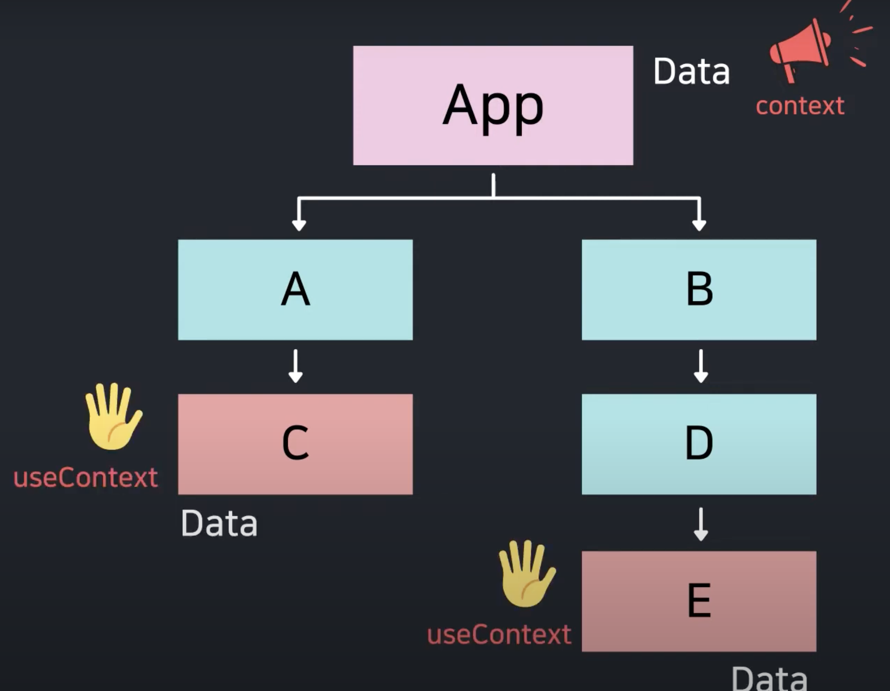

# Context API + useContext

- 리액트에서의 데이터 흐름은 부모 컴포넌트에서 자식 컴포넌트로 props를 통해 전달한다.
- 리액트 앱에서 수많은 컴포넌트로 인한 복잡한 트리 구조가 만들어지고, 각 컴포넌트에서 공통된 데이터를 필요로 하여 전달 해야하는 상황이 발생하면 단순히 데이터 전달만을 수행하는 컴포넌트로 인한 props drilling이 발생할 수 있다.
- props drilling은 변경사항이 발생했을 때 컴포넌트를 일일이 찾아서 수정해야 하므로 유지보수성이 떨어진다.
- Context API를 통해 해당 Context를 구독하는(useContext를 사용하는) 모든 컴포넌트에 공통 데이터를 바로 전달할 수 있다.

## Context는 꼭 필요한 경우에 사용하자

- Context를 사용하면 컴포넌트의 재사용이 어려워진다.
  - 컴포넌트가 Context에 대한 의존성이 발생해 Provider 외부에서 컴포넌트를 사용할 수 없다.
- Props Drilling을 피하기 위한 목적이라면 컴포넌트 합성을 먼저 고려한다.
  
> 컴포넌트 합성  
> 여러 개의 작은 컴포넌트를 조합하여 하나의 큰 컴포넌트를 만드는 방법이다.  
> 이를 통해 특정 기능을 수행하는 완성된 UI를 만드는 것  
> 이 UI를 구성하는 부모 컴포넌트로 필요로 하는 State(Lifting State Up)를 관리한다.

