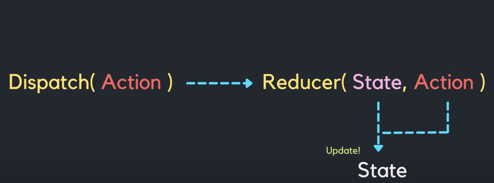

# useReducer + typescript

- 컴포넌트 내부 state의 증가로 인한 상태관리가 복잡해질 경우 사용
- 상태 업데이트 로직을 외부로 분리할 수 있어 유지보수성 증가
- Dispatch 함수를 통해 Action 객체를 Reducer로 전달하여 상태를 업데이트함



```tsx
const initialState = {
  name: '영차',
  title: '주니어개발자',
  mentors: [
    {
      name: '좋았어',
      title: '시니어개발자',
    },
    {
      name: '진행시켜',
      title: '시니어개발자',
    },
  ],
};

type State = typeof initialState;

// 이넘은 특정값들의 집합을 의마하는 자료형이다.
// 아래는 문자형 이넘
export enum ACTION_TYPE {
  UPDATED = 'updated',
  ADDED = 'added',
  DELETED = 'deleted',
}

/*
  | { type: 'updated', payload: { prev: string, current: string } }
  | { type: 'added', payload: { name: string, title: string }}
  | { type: 'deleted', payload: { name: string }};
*/

type PersonAction = {
  type: ACTION_TYPE,
  payload: {
    prev?: string;
    current?: string;
    name?: string;
    title?: string;
  }
}

export function reducer(
  state: State = initialState,
  { type, payload }: PersonAction,
): State {
  switch (type) {
  case ACTION_TYPE.UPDATED:
    return {
      ...state,
      mentors: state.mentors.map((mentor) => {
        if (mentor.name === payload.prev) {
          return { ...mentor, name: payload.current ?? '' };
        }
        return mentor;
      }),
    };
  case ACTION_TYPE.ADDED:
    return {
      ...state,
      mentors: [...state.mentors, {
        name: payload.name ?? '',
        title: payload.title ?? '',
      }],
    };
  case ACTION_TYPE.DELETED:
    return {
      ...state,
      mentors: state.mentors.filter((mentor) => mentor.name !== payload.name),
    };
  default:
    return state;
  }
}

```
