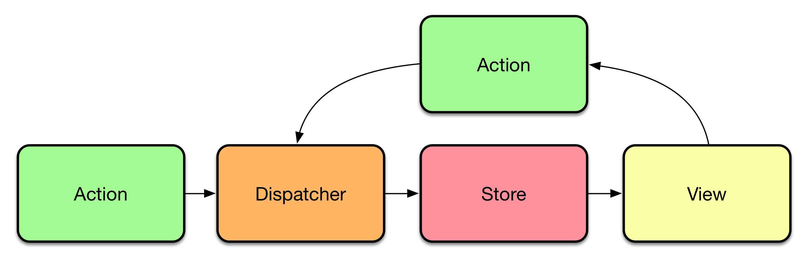

# External Store

## Keyword

1. 관심사의 분리
2. Layered Architecture
3. Flux Architecture
4. useReducer
5. useCallback

## 1. 관심사의 분리

소프트웨어의 구성 요소들이 각각 자신의 역할에만 집중하고 다른 요소와의 결합을 최소화하는 설계 원칙이다. 이를 통해 코드의 가독성, 유지보수성, 재사용성이 증가한다. 
MVC 패턴은 관심사의 분리를 강조하는 소프트웨어 아키텍처로 Model, View, Controller로 구성되어 있다.

## 2. Layered Architecture

소프트웨어 개발에서 가장 일반적으로 널리 사용되는 아키텍처(=패턴)이다. 각 계층은 어플리케이션 내에서의 특정 역할과 관심사(화면 표시, 비즈니스 로직 수행, DB 작업 등)별로 구분된다. 이는 Layered Architecture 의 강력한 기능인 **`관심사의 분리 (Separation of Concern)`** 를 의미한다. 특정 계층의 구성요소는 해당 계층에 관련된 기능만 수행한다. 다른 계층에서 일어나는 일은 관심이 없다는 얘기. 이로 인해 업데이트가 필요한 경우 해당 계층만 수정하면 되기 때문에 유지보수에 유리하고 테스트가 쉽다는 장점이 있다.

- 예를 들면, 여러 가지의 일을 하는 컴포넌트가 존재하는데 비즈니스 로직은 그대로임에도 UI를 수정할 경우 여기저기서 테스트 코드가 고장날 수 있다.
- 관심사의 분리를 통해 하나의 일만을 수행함으로서 테스트 코드 작성이 쉬워진다.


1. Presentation Layer: 화면에 정보를 표시하고 UI를 통한 유저 인터렉션을 관심사로 둔다. (ex. View, Controller)
2. Business Layer: 비즈니스 로직을 수행하는 것을 관심사로 둔다.
3. Persistence layer: 객체 관계형 매핑(ORM)과 같은 기능을 처리를 관심사로 둔다.
4. Database layer: 데이터베이스가 위치한 계층

## 3. Flux Architecture

Redux의 기반이 되는 단방향 데이터 흐름을 활용한 리액트용 애플리케이션 아키텍처, 곧바로 사용할 수 있는 프레임워크라기 보단 패턴에 가깝다.
즉 데이터의 흐름을 정의한 하나의 방법이다.

### FLUX data flow



- Action: 데이터 변화를 주기위해 발생하는 동작
- Dispatcher: 스토어로 액션을 발송하는 역할
- Store: 데이터를 저장하는 공간, 수신한 액션에 따라 상태를 변경
- View: 스토어에서 가져온 데이터를 보여주는 화면, 유저 인터렉션이 발생하면 동일한 FLUX Cycle이 반복된다.

중요한 것은 이 과정이 **`단방향으로`** 데이터가 흐른다는 것.

### MVC 패턴

Facebook에서 FLUX 아키텍처를 만든이유가 MVC 패턴에서 시작된 것으로 이에 대해 알고 갈 필요가 있다.

- 컨트롤러: 컨트롤러는 모델의 데이터를 조회하거나 업데이트한다.
- 모델: 애플리케이션의 데이터를 나타내며, 모델의 업데이트는 뷰에 반영된다.
- 뷰: 사용자가 뷰를 통해 테이터를 입력하면 모델을 업데이트한다.

그런데 만약 유저 인터렉션이 뷰를 통해 발생하고, 모델을 업데이트하고 해당 모델의 데이터를 참조하는 또다른 뷰가 업데이트 되고, 이 뷰가 또 어떤 모델을 변경하고 서로서로가 의존하게 되는 양방향 데이터 흐름은 내부 구조를 복잡하게 만든다. 기능이 간단한 애플리케이션의 경우 문제가 없겠지만 대규모 애플리케이션에서 어떤 기능이 추가된다면 복잡성이 기하급수적으로 증가하게 되고, 이는 결과적으로 예측불가능 해지며 유지보수가 어려워진다. 그렇기 때문에 데이터 흐름이 예측 가능한 FLUX 아키텍처를 설계한 것

> 각 구성요소의 역할은 컨트롤러가 비즈니스 로직을 처리하며 뷰와 모델을 연결해주고 모델은 애플리케이션의 데이터를 읽거나 업데이트, 뷰는 사용자가 볼 수 있는 화면으로 이루어져 있는데, Facebook에서 설명하는 패턴이 일반적으로 설명하는 MVC 패턴의 흐름과는 차이가 좀 있다. 혹자는 Facebook에서 잘못된 MVC 패턴을 사용하고 있었다거나, SPA 구조에 MVC 패턴을 억지로 끼워맞추다보니 이런 패턴이 발생했다는 말도 있다. Facebook에서 각각의 구성요소를 어떠한 관점으로 바라보고 있는지 잘 모르겠지만, 프론트엔드 관점에서 컨트롤러는 이벤트를 처리하는 핸들러, 각각의 모델은 컴포넌트의 상태, 뷰를 브라우저에 렌더된 UI라고 생각하면 데이터의 양방향 바인딩이 가져올 데이터 흐름을 예측하기 어렵겠다는 생각이 든다.

## 4. useReducer

컴포넌트에서 복잡한 상태관리가 필요할 경우 useReducer hook을 사용한다.

### useReducer hook 형태

```jsx
const ['상태 객체', 'dispatch 함수'] = useReducer('reducer 함수', '초기 상태', '초기 함수');
```

useReducer 함수는 state와 action 객체를 인자로 받아서 새로운 state를 반환한다. dispatch 함수는 상태 업데이트를 트리거하는데 인자로 action 객체를 받는다.

**`action 객체`**

> 어떠한 행동을 나타내는지 정의한 type 속성과 해당 행동과 관련된 데이터를 담은 payload 속성을 담고있다.

**`reducer가 뭔 뜻 이지..?`**

> reduce라는 줄이다라는 의미를 가지는데 reducer의 뜻을 찾아보면 감축기라고 나온다. 뭔소리인가 싶었는데
> 본래 reduce의 뜻은 변경이라는 의미에 가깝기 때문에 reducer는 현재 상태(previousState)를 새로운 상태(newState)로 변경할 때 사용하는 함수가 된다.

---

## 5. useCallback

React에서 성능을 최적화 할 때 사용하며, 함수를 메모이제이션(memoization)하기 위해 사용하는 hook이다.
컴포넌트는 렌더링 될 때마다 내부에 선언한 함수가 새롭게 생성되는데 useCallback을 통해 기존 함수를 저장하고 재사용한다.

**`메모이제이션(memoization)`**

> 함수 호출결과를 캐싱하고 동일한 입력이 다시 발생할 때 캐싱된 결과를 반환하는 프로그래밍 기술이다.

```jsx
const memo = useCallback('함수', '배열');
```

- 두번째 인자인 의존성 배열에 삽입한 요소의 값이 변경되면 함수를 재선언한다.
- 그런데 컴포넌트가 렌더링 될 때 마다 함수가 새로 선언되는 것은 자바스크립트가 브라우저에서 얼마나 빨리 실행되는지를 생각해보면 성능상 큰 문제가 되지 않는다.
- 따라서 단순히 컴포넌트 내부에서 함수를 반복 생성하지 않기 위해 **`useCallback()을`** 사용하는 것은 큰 의미가 없거나 오히려 **`손해일`** 수 있다.

### 자바스크립트 함수 동등성

자바스크립트에서 함수는 객체(정확히는 일급객체)로 취급되는데, 동일한 코드의 함수일지라도 다른 함수로 판단한다. 이는 메모리 주소에 의한 참조 비교를 수행하기 때문이다.(각 함수가 저장된 메모리 주소가 같지않다)

```javascript
const add1 = () => x + y; 
const add2 = () => x + y; 
add1 === add2 // false
```

이러한 자바스크립트의 특성은 함수를 다른 함수의 인자로 넘기거나, 자식컴포넌트의 props로 넘길 때 함수의 참조가 달라서 예상치 못한 성능 문제가 발생할 수 있다.

### 예상치 못한 성능 문제

fetch API를 사용해 데이터를 가져오는 fetchData 함수와 useEffect의 의존성 배열에 해당 함수를 추가한 예시다.

```jsx
import React, { useState, useEffect } from "react";

function Profile({ userId }) {
  const [user, setUser] = useState(null);

  const fetchUser = () =>
    fetch(`https://your-api.com/users/${userId}`)
      .then((response) => response.json())
      .then(({ user }) => user);

  useEffect(() => {
    fetchUser().then((user) => setUser(user));
  }, [fetchUser]);

  // ...
}
```

- fetchUser의 함수가 변경되면 useEffect를 호출해 유저 데이터를 다시 받아오는 로직이다.
- 문제점은 함수의 동등성으로 인한 서로 다른 함수로 판단하기 때문에 무한루프에 빠진다.
- userId값과 상관없이 fetchUser 함수는 렌더링될 때 마다 새로운 참조값으로 변경되기 때문에 useEffect의 effect 콜백함수를 호출하고 user 상태를 업데이트하고 컴포넌트가 리렌더되고 다시 fetchUser 함수의 참조값이 변경되고 이런 사이클의 무한루프에 빠지게 된다.

### 해결 방법

이럴때 useCallback hook을 이용해 함수의 동등성을 유지한다.

```jsx
import React, { useState, useEffect } from "react";

function Profile({ userId }) {
  const [user, setUser] = useState(null);

  const fetchUser = useCallback(
    () =>
      fetch(`https://your-api.com/users/${userId}`)
        .then((response) => response.json())
        .then(({ user }) => user),
    [userId]
  );

  useEffect(() => {
    fetchUser().then((user) => setUser(user));
  }, [fetchUser]);

  // ...
}
```

- **`useCallback()`** 훅을 이용해 함수의 참조값을 동일하게 유지시킨다.
- fetchUser함수는 의존성 배열의 userId값이 변경되지 않는한 재호출되지 않는다.

### useMemo

useMemo hook또한 메모이제이션 기법이 사용되는데, 기존과 동일한 입력이 발생할 경우 캐싱된 값을 재사용한다.
