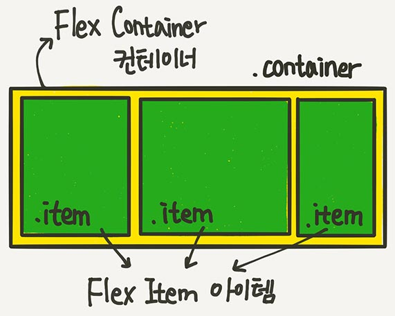

# CSS in JS

## keyword

- CSS in JS 란
- CSS

---

## 1. CSS in JS 란

CSS-in-JS는 자바스크립트를 사용하여 컴포넌트의 스타일을 지정하는 스타일링 기법이다. 자바스크립트 파일이 파싱되면 CSS가 생성되어 DOM에 추가됨.

### `Pure CSS`

- 글로벌 네임스페이스 공유하므로 스타일 규칙이 프로젝트 전체에 적용되어 별도의 네이밍 규칙 필요.
- 동일한 클래스명의 자동 오버라이딩 발생은 프로젝트의 규모가 커질수록 혼란을 야기한다.
- CSS가 분리되어 있어 JS의 상태값의 공유가 어려움.
- 부모 엘리먼트로 부터 스타일 상속받아 자식 엘리먼트가 영향을 받음.

예를 들면, Main.tsx에서 import한 css파일이 head아래의 style로 작성되기 때문에 동일명의 클래스 네임을 사용할 경우 App.tsx에서도 동일하게 스타일이 적용된다.

### `CSS-in-JS의 경우`

- class 네임이 빌드 타임이 유니크하게 변경되어 별도의 네이밍 규칙이 필요없다.
- CSS가 컴포넌트 스코프로 적용되기 때문에 클래스 네임 오버라이딩 문제 없음
- CSS 코드가 JS에 작성되므로 컴포너트 상태 공유 가능 (상태에 따른 스타일 처리에 유용)
- CSS가 컴포넌트 스코프를 가지므로 스타일 상속 문제 없음.

### `그러나 정말 CSS-in-JS가 유리할까?`

#### FOUC (Flash of unstyled content)

스크립트 구문이 분석되어 스타일이 적용되기 전 마크업 된 그대로의 모습이 순간적으로 보이는 현상.
프레임워크에 스타일시트를 생성해 문서에 적용하는 기능이 없다면 직접 구현해야함.

#### Scripting 성능

결과적으로 컴포넌트가 렌더링 될 때 런타임 오버헤드를 유발한다. CSS-in-JS 방식은 페이지 로딩 시 JS 구문 분석 과정이 필요하기 때문에 동적으로 CSS가 추가되는 구조는 느릴 수 밖에 없다.

## 2. CSS

### 정의

CSS는 웹 페이지의 레이아웃과 스타일을 정의하는 스타일 언어다.

### 선택자 (Selectors)

HTML 요소를 선택하기 위해 선택자를 사용한다. 특정 요소를 선택해 스타일을 적용할 수 있다.

**`선택자 종류`** [기억해야 하는 선택자 30개](https://webdesign.tutsplus.com/ko/the-30-css-selectors-you-must-memorize--net-16048t)

- [Attribute 선택자](https://developer.mozilla.org/ko/docs/Web/CSS/Attribute_selectors)
- Class 선택자
- ID 선택자
- 유형 선택자(span, p, a 노드 이름)
- 전체 선택자(*)
- & nesting 선택자: SCSS 같은 전처리기에 있던 선택자인데 최근에 추가된 것 같다. &는 상위 선택자를 참조한다.

### 박스 모델

문서의 레이아웃을 계산할 때, 브라우저의 렌더링 엔진은 박스 모델을 기반으로 크기 및 배치가 결정된다.

#### 박스 모델의 구성 요소

1. 콘텐츠 영역 (Content Area)
2. 패딩 (안쪽 여백, Padding)
3. 테두리 (테두리 여백, Border)
4. 마진 (바깥 여백, Margin)

> box-sizing: border-box 속성 사용시 border, padding을 고려해 박스 크기가 결정된다.  
> width: 200px 일 경우, border와 padding이 각각 10px을 차지한다면 컨텐츠 크기는 160px

### 미디어 쿼리

미디어 쿼리를 사용하면 다양한 디바이스와 화면 크기에 따라 CSS를 선택적으로 적용하여 페이지의 스타일을 지정할 수 있다.

```css
/* 화면의 너비가 600px 이하일 때 스타일을 적용 */
@media screen and (max-width: 600px) {
}
```

### Flexbox [링크](https://studiomeal.com/archives/197)

Flexbox를 사용하면 자식 요소들을 효과적으로 정렬하고 요소 사이의 공간 배분을 조절할 수 있다.



### Grid [링크](https://studiomeal.com/archives/533)

Grid는 수평선, 수직선으로 이루어진 이차원 레이아웃 시스템이다. Flex와 동일하게 컨테이너와 아이템으로 레이아웃을 잡을 수 있다.


---

## 추가 키워드

### CSS-in-CSS
