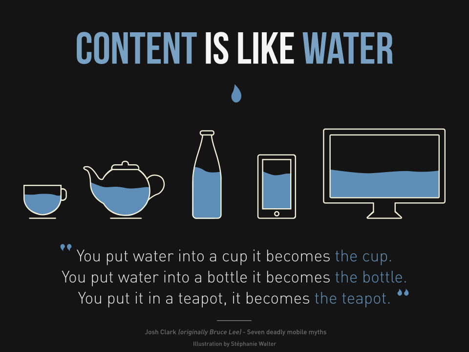

# Design System

## Keyword

- 반응형 웹 디자인(Responsive web design)
- 디자인 시스템(Design System)
- Atomic Design

---

## 1. 반응형 웹 디자인(Responsive web design)

하나의 웹 사이트가 다양한 디바이스의 화면에 따라 컨텐츠 크기가 자동으로 변화하는 웹 디자인 방식



### **`반응형 웹 기술`**

#### 뷰포트에 맞게 크기조정 - 반응형 이미지

이미지의 크기는 고정되어 있으며 뷰포트보다 크면 스크롤바가 나타난다. 모든 이미지에 `100%`의 `max-width`를 설정한다. 뷰포트 크기가 이미지보다 작은 경우 이미지가 화면 너비에 맞게 축소된다.

```css
img {
  max-width: 100%;
}
```

#### 뷰포트에 맞게 크기조정 - 레이아웃

컨텐츠의 width에 고정값(px)이 아닌 em 또는 %값으로 설정한다. 화면 너비에 따라 컬럼의 크기가 상대적으로 변화한다.

#### 미디어 쿼리

미디어 쿼리를 사용하면 다양한 디바이스와 화면 크기에 따라 CSS를 선택적으로 적용하여 페이지의 스타일을 지정할 수 있다.

```css
/* 화면의 너비가 600px 이하일 때 스타일을 적용 */
@media screen and (max-width: 600px) {
}
```

#### Flexbox

Flexbox를 사용하면 자식 요소들을 효과적으로 정렬하고 요소 사이의 공간 배분을 조절할 수 있다.


#### Grid [링크](https://studiomeal.com/archives/533)

Grid는 수평선, 수직선으로 이루어진 이차원 레이아웃 시스템이다. Flex와 동일하게 컨테이너와 아이템으로 레이아웃을 잡을 수 있다.


#### 뷰포트 메타 태그

---

## 2. 디자인 시스템(Design System)

### **`정의`**

디자인 시스템이란 재사용 가능한 컴포넌트와 UI 패턴을 사용하여 다앙한 규모의 디자인을 관리하기 위한 표준을 제공한다.

웹 사이트를 PC용, 모바일용으로 따로 만들 필요없이 하나의 공용 웹사이트를 만들어 다양한 디바이스에 대응할 수 있다.

### **`Nielsen Norman Group의 요약`**

디자인 시스템은 다양한 페이지와 채널에서 일관된 디자인을 만들고 중복을 줄여 다양한 규모의 디자인을 관리하기 위한 일련의 표준이다.

### **`디자인 시스템은 왜 필요한가?`**

1. 디자인 및 개발을 빠르게 작업하고 복제할 수 있다. - 재사용 가능한 컴포넌트, UI를 활용해 빠르게 작업하고 복제할 수 있다.
2. 협업에 기여 - 프로젝트 구성원 간의 지식 격차를 줄이고 공통의 원칙을 숙지하여 협업에 기여할 수 있다. 이는 낭비되는 시간을 줄이고 프로젝트 생산성을 향상시킨다.
3. 일관성 있는 사용자 경험 - 서로 다른 페이지나 플랫폼에 디자인 일관성을 조성해 사용자 경험을 제공한다.

---

## 3. Atomic Design

웹 애플리케이션 UI를 구성하는 데 있어서 작은 단위부터 시작하여 큰 요소로 조합해 나가는 디자인 시스템 방법론

크게 5가지로 구성 요소로 이루어져 있다.

**`Atoms, Molecules, Organisms, Templates, Pages`**

* Atom\
  Atom은 컴포넌트를 가장 작은 단위로 분리한 것으로 일반적으로 HTML element 단위로 작성된다. 단독 사용은 어렵고, Atom 단위를 molecule, organism 단위로 결합해 유용하게 사용할 수 있다.
* Molecule\
  여러개의 Atom을 조합하여 SRP를 만족하는 하나의 일을 수행하는 단위. Input Atom에 텍스트를 입력하고 Button Atom을 클릭해 form을 전송하는 molecule의 예시가 있다. 하나의 책임을 가지므로 재사용성과 UI의 일관성, 테스트에 용이하다.
* Organism\
  웹 서비스에서 표현될 수 있는 명확한 레이아웃과 특정 컨텍스트(특정 코드, 영역에 대한 환경정보)를 가진다. 컨텍스트를 가지기 때문에 재사용이 어렵다.
* Template\
  실제 콘텐츠는 없는 컴포넌트를 페이지 레이아웃에 맞게 배치한 와이어 프레임, 스켈레톤 UI
* Page\
  유저가 볼 수 있는 실제 컨텐츠를 담고 있다.
